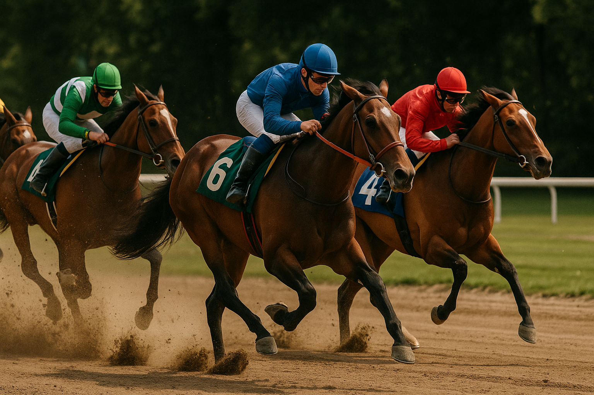
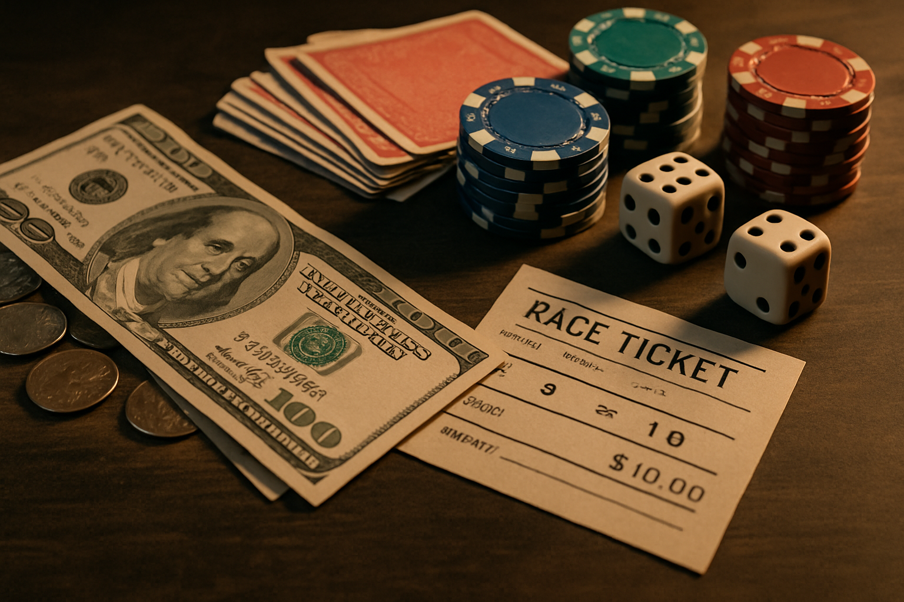

---

## 飲み会の席で、こんな話を聞いたことはないだろうか

「パチンコも競馬も、トータルで見れば勝ってるから」

自信たっぷりに言い切るあの感じ。SNSでも、依存症の回復コミュニティでも、同じ言葉を繰り返す人がいる。本人はいたって真剣だし、嘘をついているわけでもない。少なくとも、本人の「記憶の中では」そうなっている。

でも、その記憶、どこまで信用していいんだろう？

## パチンコや競馬の「仕組み」を冷静に見る

ギャンブルには「控除率」というものがある。聞き慣れない言葉かもしれないけれど、要は**胴元の取り分**のこと。

パチンコ・パチスロなら投入金額の15〜20%、競馬なら約25%、宝くじに至っては半分以上が戻ってこない。つまり100円賭けるたびに、15円〜50円は最初から消えている計算になる。

1回や2回なら運で勝てる。でも100回、1000回と続ければ、この「見えない手数料」が積み重なって、収支は確実にマイナスに近づいていく。数学では「大数の法則」と呼ばれる現象で（Tversky & Kahneman, 1971）、プレイ回数が増えるほど結果は理論値に収束する。

「もっと続ければ取り返せる」という発想が、構造的に成り立たない理由がここにある。

## 脳が「勝っている」と錯覚させるカラクリ

それでも「トータルでプラス」と感じてしまうのは、意志が弱いからじゃない。脳のクセ、心理学では**認知バイアス**と呼ばれるものが関わっている。

### 勝った日だけ、やけに鮮明に覚えている

5万円勝った日のことは、その夜何を食べたかまで思い出せる。でも3万円負けた日は？　「まあ、調子悪かったな」くらいの薄い記憶しか残っていなかったりする。

これが**確証バイアス**。自分が信じたいことに合う情報ばかり拾って、都合の悪い情報はスルーしてしまう脳の性質だ（Nickerson, 1998）。差し引きすればマイナス4万円なのに、「勝ってる」と感じてしまう。記憶は家計簿じゃない。都合よく編集される。

### 「5回負けたから次は当たる」の落とし穴

ルーレットで黒が10回続いたら、「さすがに次は赤だろう」と思いたくなる。けれど、ルーレットに記憶はない。次に赤が出る確率は、何回黒が続こうが変わらない。

**ギャンブラーの誤謬**と呼ばれるこの思考パターン。「そろそろ来るはず」という根拠のない期待が、ずるずると賭けを続けさせる燃料になっている。

### 「ここまで突っ込んだのに、やめられない」

10万円使った後に「ここでやめたら10万円が無駄になる」と感じて、さらに5万円を突っ込む。冷静に考えれば、すでに失った10万円はやめても続けても戻らない。頭ではわかっている。でも感情がブレーキを踏ませてくれない。

**サンクコストの誤謬**と呼ばれるこの心理。「損切り」が怖くて、結局もっと大きな損を抱えることになる。

[なぜギャンブルをやめられないのか？](/ja/blog/why-cant-you-stop-gambling)でも触れているけれど、こうしたバイアスは脳の構造的な特性で、特定の誰かだけに起きるものじゃない。だからこそ、「自分にも起きている」と知ることに意味がある。

## 「トータル勝ち」が手放せない本当の理由

ギャンブル依存が深まるほど、「トータルでは勝ってる」という主張は強くなる傾向がある。

なぜか。

「勝っている」と思い続けている限り、自分の行動を問題視しなくて済むからだ。「勝ってるなら大丈夫」「負けたのは一時的」「次で取り戻せる」、こうした言葉が自分を守るための盾になっている。

依存症の本質は、[「問題」ではなく「解決策」として始まった行動](/ja/blog/addiction-is-solution-not-problem)にあることが多い。不安、ストレス、孤独、退屈。そういったものから一時的に逃れる手段としてギャンブルが機能しているとき、「トータル勝ち」はその行動を続けるための最強の言い訳になる。

そして言い訳を繰り返すうちに、負債は膨らみ、依存はさらに深くなっていく。出口がどんどん遠くなる悪循環。

## 本当に「トータル勝ち」の人はいるのか

ゼロではない。競馬やスポーツベッティングの世界には、徹底した分析と感情を排した資金管理で収支をプラスに保つ「プロ」が、ほんの一握りだけ存在する。

ただ、彼らの生活は想像とかなり違う。膨大な時間をデータ分析に費やし、不調期には大きな損失も出す。[スポーツベッティングの構造的リスク](/ja/blog/sports-betting)を熟知したうえで、一般のギャンブラーとはまるで別の次元で動いている。「自分もトータルで勝てる」と思うのは、草野球の選手がプロ野球選手の年俸を見て「俺もいける」と思うようなもの。

それに、仮にお金の面ではプラスだったとして、費やした時間、睡眠、人間関係。そこまで含めて「勝ち」と呼べるのか。そう考えると、答えは少し変わってくるかもしれない。

## 「トータル勝ち」の呪縛から離れるには

### 収支を、全部書き出してみる

記憶に頼るから錯覚が生まれる。アプリでもノートでもいいから、1円単位で記録してみてほしい。交通費も、食事代も、パチンコ屋で過ごした時間も全部。数字を並べてみると、記憶の中の「勝ち」と現実の間にあるギャップに気づくことがある。

### 自分以外の目を借りる

認知バイアスの厄介なところは、自分一人では気づきにくいこと。信頼できる人に収支を見せてみるとか、同じ経験をした人の話を聞いてみるとか。QuitMateのようなコミュニティで体験を共有してみるのも、客観的な視点を取り戻すひとつの方法だと思う。

### ギャンブルの「裏にあるもの」に目を向ける

お金を増やしたいのか、退屈を紛らわせたいのか、何かから逃げたいのか。ギャンブルに向かう本当の動機は人それぞれ違う。でも、その問いを自分に投げかけるだけでも、[何かが変わり始める](/ja/blog/reflection-changes-behavior)ことがある。

---

## おわりに

「トータルで勝っている」。その言葉を口にするとき、少しだけ立ち止まってみてほしい。

確証バイアス、ギャンブラーの誤謬、サンクコストの誤謬。名前は難しそうだけど、やっていることはシンプルで、脳が「都合のいいストーリー」を作っているだけだ。これは誰の脳にも備わっている機能で、恥ずかしいことでも何でもない。

ただ、その錯覚に気づけるかどうかで、この先の選択はだいぶ変わってくる。

収支を書き出すのは、正直しんどい作業かもしれない。見たくない数字が並ぶかもしれない。でもそれは、自分の現在地を正確に知るということでもある。

一人で向き合うのがきつければ、同じ道を歩いてきた人の力を借りてもいい。

---

### 参考文献

- Tversky, A., & Kahneman, D. (1971). *Belief in the law of small numbers*. Psychological Bulletin, 76(2), 105-110.
- Nickerson, R. S. (1998). *Confirmation bias: A ubiquitous phenomenon in many guises*. Review of General Psychology, 2(2), 175-220.
- Clark, L., et al. (2013). *Pathological choice: the neuroscience of gambling and gambling addiction*. The Journal of Neuroscience, 33(45), 17617-17623.
- 厚生労働省 (2021). 「ギャンブル等依存症対策推進基本計画」
- WHO (2019). *International Classification of Diseases 11th Revision (ICD-11)*: Gambling disorder (6C50).
