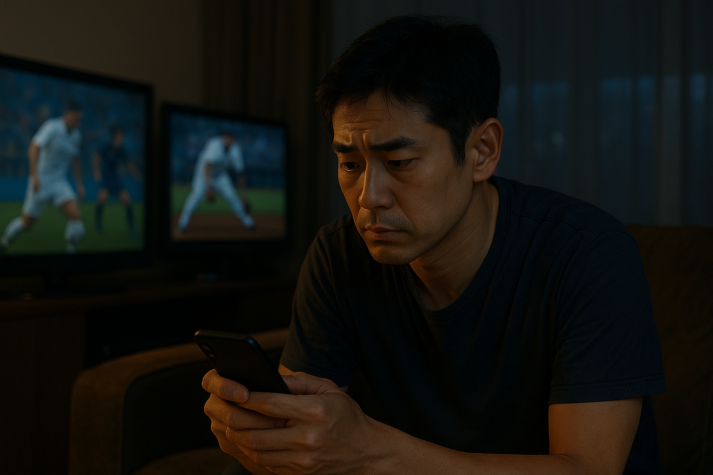

日曜の夜、ソファに寝転んでサッカーを見ていた。前半終了、1-0。スマホに通知が来る。「後半開始のライブオッズが更新されました」。親指が勝手にアプリを開く。500円だけ。そう思ってタップした15分後、気づけば3回追加ベットしていた。

こういう経験、心当たりがある人は少なくないと思います。

いま日本では、公営ギャンブルのネット投票を含む売上が**約7.8兆円（2023年度）**。toto/BIGなどのスポーツくじも**過去最高の1,203億円**を記録しました。さらに海外の違法ベッティングサイトには**推計6.45兆円**が流れているとも言われています。スマホ1台あれば、24時間どこでも賭けられる時代。「ちょっとした遊び」と「依存」の境界は、自分で思っているよりもずっと曖昧です。

---

## 試合中ベットが"沼"になる仕組み

スポーツベッティングが厄介なのは、「自分の判断で勝てる」と感じやすいところにあります。

カジノのスロットなら「運だよね」とどこかで思える。でもスポーツは違う。選手のコンディション、チームの相性、天候、直近の戦績。調べれば調べるほど「根拠のある賭け」をしている気になれる。そこに試合中のライブベッティングが加わると、数秒ごとに変わるオッズが"今がチャンスだ"という興奮を途切れさせません。

[なぜギャンブルをやめられないのか](/ja/blog/why-cant-you-stop-gambling)でも触れていますが、このとき脳の中ではドーパミンが繰り返し分泌されています。報酬系が過剰に活性化すると、理性を司る前頭前野のブレーキが利きにくくなる。「やめようと思ってたのに、気づいたら賭けてた」。意志の弱さではなく、脳の構造的な反応です。

さらに厄介なのが「ニアミス効果」。惜しい外れでも脳は"もうちょっとだった"という快感を受け取ってしまう。実際には負けているのに、体は「次こそ」と感じている。冷静に収支をつけると大半の人が赤字なのに、[トータルで勝っていると思い込んでしまう](/ja/blog/gamble-winning)のは、この認知バイアスの仕業です。

---

## 「たかが500円」が止まらなくなるまで

「500円くらいなら大丈夫」。そう思って始めた人は多い。でも、連敗すると「取り返したい」が生まれる。惜しい外れが続けば「次こそ」と思う。クレジットカードやスマホ決済なら、数秒で再入金できてしまう。ATMに行く手間も、財布の中身を確認する瞬間もない。冷静になる"隙間"が、設計上ほぼ存在しないんです。

それに加えて、SNSやYouTubeを開けば有名人がベッティングアプリのプロモーションをしている。友達のストーリーで「今日の的中！」なんて投稿が流れてくる。スポーツ観戦の一部として"当たり前の遊び"に見えてしまう空気。とくに10代後半〜20代にとっては、始めない理由のほうが見つけにくいかもしれません。

---

## 「やめたい」と思ったときにできること

ここからは、実際に距離を置くためにできることを書いていきます。全部いっぺんにやる必要はありません。「これならできそう」と思えたものから一つだけ試してみてください。

### まず、自分の数字を見る

1週間のベット金額、回数、勝敗を記録してみる。スマホのスクリーンタイムでアプリの利用時間も見てみる。たいてい「思ってたより多い」と気づきます。そしてその"気づき"自体が、変化のきっかけになります。

QuitMateのギャンブル断ち記録では、日数だけでなく衝動や気分の波もあわせて可視化できます。数字にすると、自分の状態が驚くほどクリアに見えてくる。

### 物理的にアクセスを断つ

意志の力だけで「開かない」を続けるのは、正直かなりキツい。だからこそ環境ごと変えてしまうのが手っ取り早いです。

- **Gamban**などのアクセス遮断アプリを入れる
- 銀行やクレカに**ギャンブル関連のMCCコードブロック**を申請する
- 公営競技の**自己排除制度**に登録する

「自分で自分を止められない」と認めるのは弱さじゃない。むしろ、回復に向けた最も合理的な判断です。

### "賭けるまでの手間"を意図的に増やす

入金に**24時間のクールダウン**を設定する。賭け専用のプリペイドカードに**週の上限金額だけチャージ**して、それ以上は物理的に使えなくする。

「ついでに賭ける」を防ぐのは、"面倒くささ"です。衝動は長くは続かない。その数分〜数時間をやり過ごす仕組みさえあれば、嵐は過ぎていきます。

ちなみに、[エアーベット（架空の賭け）で我慢する方法](/ja/blog/paper-betting)は、一見よさそうに見えて逆効果です。賭けたい気持ちを"練習"してしまい、渇望が再燃するリスクがあります。

### 別のドーパミンを見つける

ギャンブルがくれていたのは、短時間の集中と「勝った！」という快感。これを別のもので埋めないと、空白がつらくなる。

HIIT（高強度インターバルトレーニング）で体を追い込む。語学アプリでスコアを伸ばす。将棋やチェスのオンライン対戦で頭を使う。なんでもいい。「のめり込める何か」を一つ持っておくと、賭けたい衝動が来たときの逃げ場になります。

### 誰かに話す

一番ハードルが高くて、一番効くのがこれです。

家族に言えないなら、まずは匿名の相談窓口から。**ギャンブル依存症相談窓口（0120-683-705）**は24時間対応で、名前を言う必要もありません。

QuitMateの「Quit Gambling」コミュニティには、同じ経験をしてきた人たちがいます。体験談を読むだけでも「自分だけじゃなかった」と思えることがある。[ピアサポートの研究](/ja/blog/peer-support)では、同じ経験を持つ仲間とつながった人は治療を続けられる割合が約1.4倍になったというデータもあります。

**CBT（認知行動療法）**や**動機づけ面接**といった専門的なアプローチも、再発リスクを大きく下げることがわかっています。「相談する」は、回復のスタートラインに立つということです。

---

## おわりに

スポーツベッティングは、見た目はスマートで戦略的な遊びに見えます。でもその裏側は、秒単位で脳の報酬回路を刺激し続ける仕組みそのもの。

もし今日、賭けを1回だけ我慢できたなら、それはもう"1勝"です。

「やめたいけど、何からすればいいのかわからない」。そう感じている人は、[ギャンブルをやめる5ステップ](/ja/blog/quit-gambling-steps)もあわせて読んでみてください。焦らなくて大丈夫。一歩ずつで、ちゃんと変わっていけます。

---

## 参考文献

1. 総務省・農林水産省・国土交通省ほか「公営競技の売上推移（2023年度）」
2. 毎日新聞「海外スポーツベッティング流出額 推計6.45兆円」2025年5月22日付
3. 独立行政法人 日本スポーツ振興センター「スポーツくじ 2023年度売上実績報告」
4. 国立精神・神経医療研究センター「ギャンブル等依存症 臨床ガイドライン」2024年版
5. Gainsbury, S. M. et al. "In-Play Betting and Problem Gambling: A Systematic Review." *Journal of Gambling Studies*, 2023.
